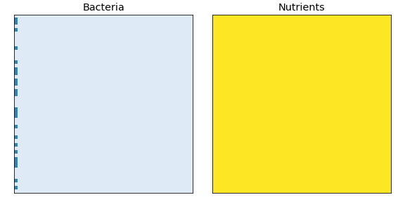

# Biofilm simulation

This repository contains source code for a 2D biofilm simulation based on the implementation outlined in *Introduction to Computational Science* by Angela and George Shiflet \[1\].

**Table of contents**
*   [About the simulation](#about-the-simulation)
    *   [Supplemental materials](#supplemental-materials)
*   [Requirements](#requirements)
*   [Compilation](#compilation)
*   [CLI interface](#cli-interface)
*   [Development](#development)
*   [Repository organization](#repository-organization)
*   [License](#license)
*   [References](#references)

## About the simulation

From Shiflet and Shiflet \[1\]:

> Biofilms are communities of very small organisms that adhere to a surface (substratum) in an aqueous environment (Donlan and Costerton 2002).
> These organisms are usually bacteria, but algae or fungi may also form biofilms.
> \[...\]
> \[This implementation simulates\] the formation of the structure of a biofilm without regard to its function.

The animation below demonstrates what the simulation looks like in practice:



The simulation consists of a **bacteria grid** and a **nutrients grid** that update in tandem.
Nutrients continuously diffuse into the simulation area and the bacteria consume the nutrients while they grow through cellular division.
This generates the various structures seen in the animated image.
If the nutrients run out in a particular cell, then the bacterium dies.
The total area reached by the bacteria depend on parameters such as the growth rate, the diffusion rate, the consumption rate, etc.

<table>

<tbody>

<tr>

<td>

### Supplemental materials

A full, step-by-step discussion of how to implement biofilm simulation is available in the following module: [Angela B. Shiflet and George W. Shiflet, *Biofilms: United They Stand, Divided They Colonize*](https://drive.google.com/file/d/1SzQCvDYPttZXWzs4fTeFwUzaFuVdE7yc).
This is an earlier edition of what would become chapter 10.5 in *Introduction to Computational Science* \[1\].
Please note that there are slight differences in implementation, with the most notable difference being the formula applied during the growth phase.

</td>

</tr>

</tbody>

</table>

## Requirements

*   C++11 compatible compiler (tested with GNU v5.2.0 and v7.3.0)

*   CMake (>= v3.10)

*   (Optional) clang-format (>= v6.0)

*   (Optional) Anaconda (>= v5.0.0)

## Compilation

Code compilation is handled via cmake.
A simple script file `make.sh` is included that can be used to help compile your code on your local computer.
To run this script it using `make`, invoke,

```sh
make build-local
```

If you have all the necessary dependecies installed, then your code should compile in a `build/` folder.
After compilation, the compiled binary will be copied into a folder called `bin/`.
Running `make build-local` after you make a change to the code will recompile the changed file and update the binary.
In most instances you should not need to delete the `build/` directory.

If you are compiling this code on the George Mason University ARGO cluster, then you should instead invoke

```sh
make build-argo
```

This will make the script first load the necessary environment modules before proceeding with compilation.

## CLI interface

A simple command-line interface is used to launch the simulation.
Running `./bin/biofilm -h` will bring up the help:

    Usage: ./bin/biofilm [OPTIONS] [mode]

    Positionals:
      mode TEXT in {serial}

    Biofilm simulation run modes
      serial:   (default) Serial version of simulation.

    Options:
      -h,--help                   Print this help message and exit
      -d,--dim INT x 2            Set number of rows, columns [default: 400 100]
      -s,--summary TEXT           Save benchmark summary to csv file
      -o,--output TEXT            Save simulation history to csv file
      -t,--time-steps INT         Total time steps to run simulation [default: 1000]
      --prob-init FLOAT in [0 - 1]
                                  Probability to initialize bacteria [default: 0.5]
      --prob-divide FLOAT in [0 - 1]
                                  Probability that a bacterium divides [default: 0.3]
      -c,--consume FLOAT in [0 - 1]
                                  Nutrients bacteria consume per time step [default: 0.1]
      --diffusion-rate FLOAT in [0 - 0.125]
                                  Diffusion rate for nutrients [default: 0.1]
      --max-nutrient FLOAT in [0 - 1]
                                  Initial fill value for nutrient grid [default: 1.0]
      --seed UINT                 Random number generator seed

Right now there is only one mode, `serial` mode.
Additional modes such as `openmp` or `mpi` may be added later.

As an example, to run a 400×100 simulation that outputs the benchmark summary data to a csv file named `benchmark.csv`, you would run:

```sh
./bin/biofilm -d 400 100 -s benchmark.csv serial     # The serial at the end is optional
```

To run a 50×50 simulation with 150 time steps that outputs the simulation history to a csv file named `history.csv`, you would run:

```sh
./bin/biofilm -d 50 50 -t 150 -o history.csv serial  # The serial at the end is optional
```

## Development

To work on the code base, you'll need to install the optional [requirements](#requirements).
If you have Anaconda installed, then you can use `make` to set up the Anaconda virtual environment and configure the pre-commit hooks,

```sh
make dev
```

The pre-commit hooks check that you've reformated your code using `clang-format` before you can push to GitHub.
If you have not, then it runs `clang-format` for you.
To run `clang-format` manually, invoke,

```sh
make prettify
```

## Repository organization

    .
    ├── CMakeLists.txt             <- Top-level CMakeLists.txt with global project settings.
    │                                 DO NOT EDIT!
    │
    ├── environment.yml            <- Conda environment file. Creates virtual environment for
    │                                 using pre-commit hooks and animate.py.
    │
    ├── img                        <- Images directory.
    │   │
    │   └── biofilm.gif            <- Sample biofilm animation created using animate.py.
    │
    ├── LICENSE                    <- License file for repository.
    │
    ├── Makefile                   <- Top-level Makefile. Type make for a list of valid commands.
    │
    ├── make.sh                    <- Bash script for compiling the source code using cmake.
    │                                 Run ./make.sh without arguments to view the help message.
    │
    ├── README.md                  <- The top-level README for this project.
    │
    ├── scripts                    <- Directory for miscellaneous scripts
    │   │
    │   └── animate.py             <- Script to generate animations using simulation history files.
    │
    ├── src                        <- Source code directory for the biofilm simulation.
    │   │
    │   ├── cli.cpp                <- Command-line interface for setting simulation parameters.
    │   ├── cli.hpp
    │   │
    │   ├── CMakeLists.txt         <- Compilation settings for biofilm simulation. Edit this when
    │   │                             adding new files or to change compiler settings.
    │   │
    │   ├── components.hpp         <- Defines the data containers used in the simulation.
    │   │
    │   ├── consumption_system.cpp <- Routines for bacteria consumption phase of simulation.
    │   ├── consumption_system.hpp
    │   │
    │   ├── copy_system.cpp        <- Routines to refresh the grid copies and padding (ghost cells).
    │   ├── copy_system.hpp
    │   │
    │   ├── data.hpp               <- Smaller data containers used as inputs and outputs in functions.
    │   │
    │   ├── diffusion_system.cpp   <- Routines for the nurtients diffusion phase of simulation.
    │   ├── diffusion_system.hpp
    │   │
    │   ├── entities.hpp           <- Defines the Entities struct that manages the list of components.
    │   │                             A bit-field is used to toggle different components on and off,
    │   │                             which defines the difference between cells and the padded
    │   │                             region (ghost cells).
    │   │
    │   ├── growth_system.cpp      <- Routines for dividing bacteria to grow a biofilm structure.
    │   ├── growth_system.hpp
    │   │
    │   ├── initializers.cpp       <- Routines for creating the Entities class and initializing the
    │   ├── initializers.hpp          components.
    │   │
    │   ├── neighbors.cpp          <- Routines for sensing and picking neighboring cells.
    │   ├── neighbors.hpp
    │   │
    │   ├── simulation.cpp         <- Simulation driver. Uses _system files to transform components
    │   ├── simulation.hpp            in Entities struct during each time step.
    │   │
    │   ├── utilities.cpp          <- Miscellaneous helper routines.
    │   └── utilities.hpp
    │
    └── vendor                     <- Directory for storing third-party libraries.
        │
        └── CLI11                  <- CLI11 is a command line parser for C++11 and beyond that provides
            │                         a rich feature set with a simple and intuitive interface. See
            │                         https://github.com/CLIUtils/CLI11 for documentation.
            │
            └── CLI11.hpp          <- Header-only file for CLI11 library.

## License

MIT

## References

1.  Shiflet, Angela B., and George W. Shiflet. Introduction to Computational Science: Modeling and Simulation for the Sciences. 2nd ed., Princeton University Press, 2014.
